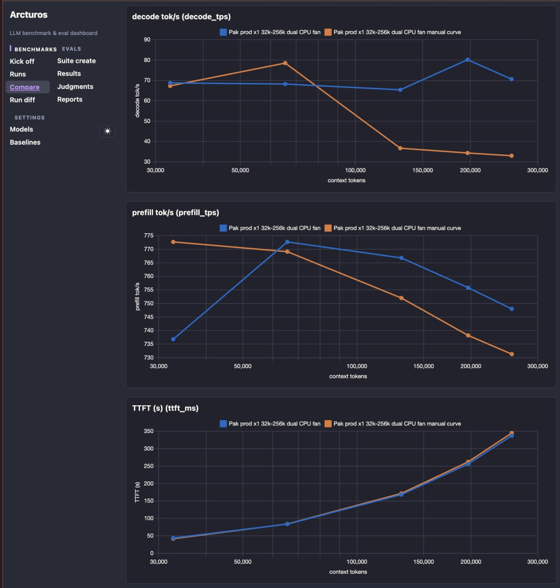

# Arcturos

**Local-first LLM benchmarking & evaluation dashboard**

Arcturos benchmarks LLM inference servers and evaluates their outputs — all data stays in a local SQLite file you own. Compare, diff, and replay every run.



*The Compare view: decode / prefill throughput and time-to-first-token, plotted per context length for any set of runs.*

## What it does

- **Benchmark** any OpenAI-compatible (or llama.cpp native) inference server — decode tok/s, prefill tok/s, TTFT, wall time, MTP/speculative acceptance, parallel streams, at multiple context lengths
- **Compare** runs side-by-side with charts, pinned baselines, and per-metric deltas
- **Evaluate** prompts (single- and multi-turn) scored blind by external LLM judges — pairwise A/B preference with win rates by judge and category
- **Reports** summarizing suite win rates and coverage
- **CSV export** of runs, comparisons, eval results, and judgments
- **Append-only storage** — measurement rows are never mutated; visibility and naming are separate, reversible layers

## Quick start

```bash
git clone https://github.com/waxinz/arcturos.git
cd arcturos
python3 -m venv venv && venv/bin/pip install -r requirements.txt

uvicorn arcturos.main:app --host 0.0.0.0 --port 24816
```

Open `http://localhost:24816` — the sidebar walks you through the three sections:

| Section | Pages |
|---|---|
| **Benchmarks** | Kick off · Runs · Compare · Diff |
| **Evals** | Suite create · Results · Judgments · Reports |
| **Settings** | Models · Baselines |

### Configuring defaults

Defaults live in `arcturos.toml` (committed template). To point your install at your own inference server, create `arcturos.local.toml` alongside it — it is gitignored, so your hostnames and keys never leave your machine:

```toml
[bench]
server_url = "http://your-inference-host:8000"
model = "your-model-name"

[demo]
live_targets = ["http://your-inference-host:8000"]
judge_url = "http://your-judge:4000/v1"
```

Environment variables override everything (`ARCTUROS_BENCH__SERVER_URL=…`, `ARCTUROS_DEMO__JUDGE_URL=…`). API keys are sent per-request only; nothing is stored.

### Demo data

`scripts/seed_demo.py` seeds synthetic benchmark rows and eval suites end-to-end so the dashboard has something to show before your first real run:

```bash
venv/bin/python scripts/seed_demo.py
```

## Tests

```bash
venv/bin/python -m pytest tests -q
```

233 tests, append-only semantics included.

## License

MIT